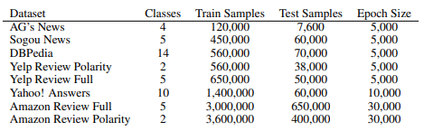

# Bag of Tricks for Efficient Text Classification

This is the implementation of [Bag of Tricks for Efficient Text Classification](https://aclanthology.org/E17-2068/) (Joulin et al., EACL 2017) on python with pytorch library.

## Results

| dataset |          models          | paper | mine |
| ------- | ------------------------ | ----- | ---- |
|    AG   |    fastText, h = 10      | 91.5  | 91.1 |
|         | fastText, h = 10, bigram | 92.5  | 91.2 |
|  Sogou  |    fastText, h = 10      | 93.9  | 91.6 |
|         | fastText, h = 10, bigram | 96.8  | 95.7 |
|   DBP   |    fastText, h = 10      | 98.1  | 98.2 |
|         | fastText, h = 10, bigram | 98.6  | 98.4 |
| Yelp P. |    fastText, h = 10      | 93.8  | 92.6 |
|         | fastText, h = 10, bigram | 95.7  | 94.5 |
| Yelp F. |    fastText, h = 10      | 60.4  | 58.7 |
|         | fastText, h = 10, bigram | 63.9  | 61.8 |
| Yah. A. |    fastText, h = 10      | 72.0  | 70.8 |
|         | fastText, h = 10, bigram | 72.3  | 71.3 |
| Amz. F. |    fastText, h = 10      | 55.8  | 55.3 |
|         | fastText, h = 10, bigram | 60.2  | 59.6 |
| Amz. P. |    fastText, h = 10      | 91.2  | 91.0 |
|         | fastText, h = 10, bigram | 94.6  | 94.2 |

## Specification
- **model.py** : fastText model for sentence classification
- **train.py** : Training process
- **utils.py** : Preprocessing, etc.
- **data.py** : Get train, test data from csv file, etc.

## Dataset

## Development Environment
- OS: Ubuntu 18.04.5 LTS (64bit)
- Language: Python 3.10.13
- CPU: AMD Ryzen Threadripper 2920X 12-Core Processor
- GPU: GeForce GTX 2080 Ti

## Requirements
    numpy==1.26.3
    torch==2.3.0
    pytorch-cuda==11.8

## Execution
    python train.py